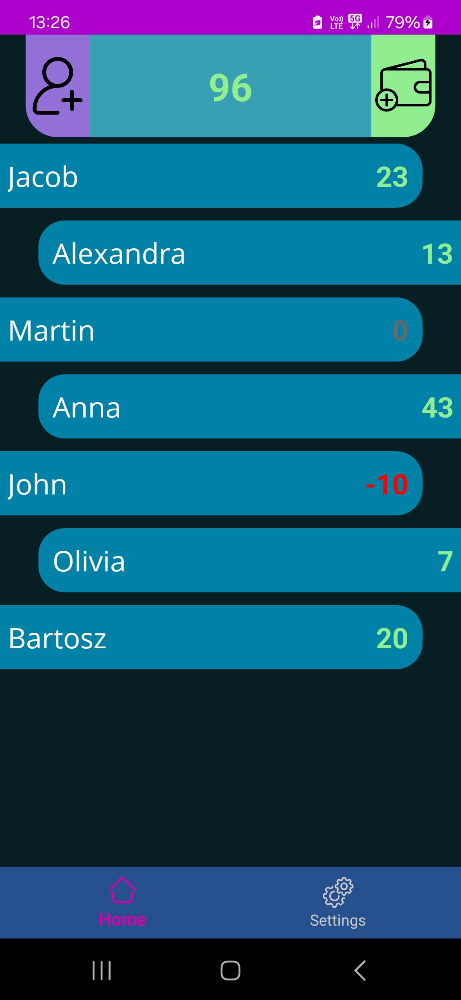
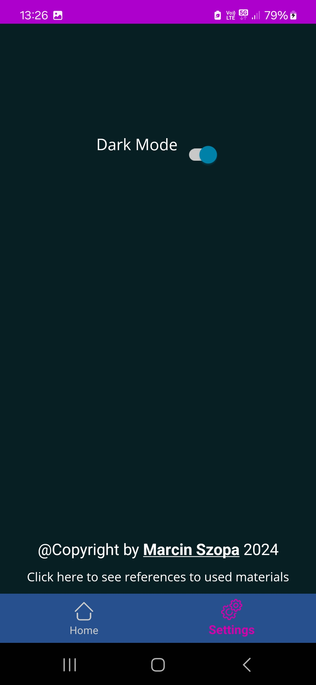
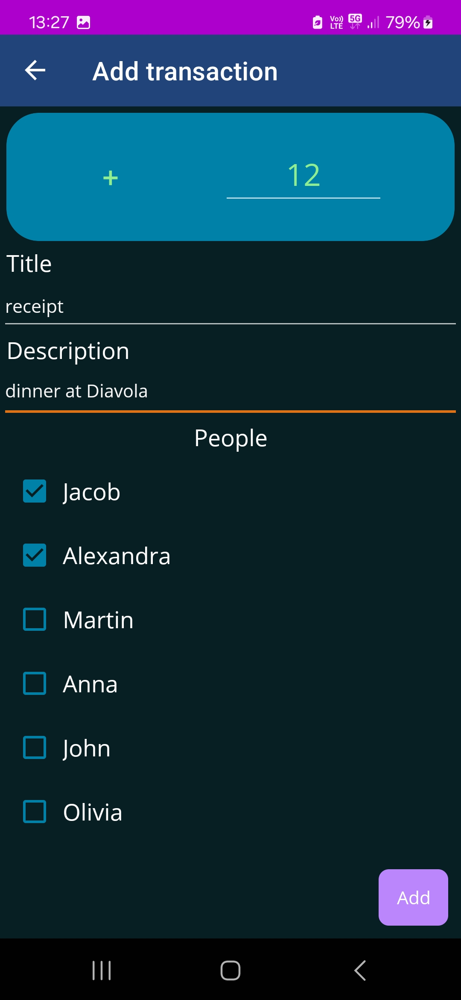
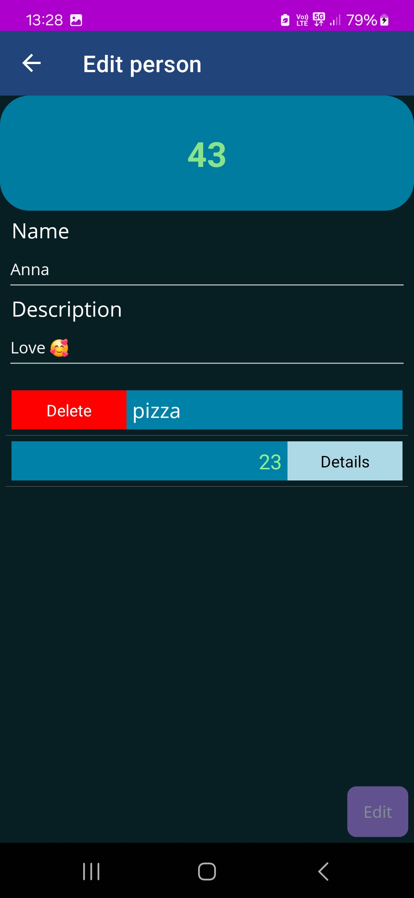

# Draftor
Draftor is an intuitive application designed to empower users in managing their personal finances efficiently. With Draftor, users can seamlessly track their expenses, monitor their debts, and not to forgot who borrowed from them.

## Features
- **Person Management**: Easily create and manage individual profiles for each person involved in your financial transactions.
- **Transaction Tracking**: Record transactions effortlessly, specifying the amount, recipient, and purpose, facilitating accurate balance updates for both the user and the respective person involved.
- **Balance Management**: Keep track of balances for each person, ensuring transparency and accountability in financial dealings.

## Tech Stack
- **.NET 8**
- **MAUI Framework**: Built using MAUI, Draftor ensures seamless cross-platform compatibility, allowing users to access their financial data from various devices. (only android was tested)
- **MVVM Pattern**: The MVVM (Model-View-ViewModel) architecture enhances maintainability and testability, providing a clear separation of concerns and facilitating easier code organization.
- **Clean Architecture**: Draftor follows Clean Architecture principles, ensuring scalability, maintainability, and flexibility in software design and development.
- **Entity Framework with SQLite Provider**: Data storage is managed efficiently using Entity Framework, with the SQLite provider offering a lightweight and reliable solution for storing financial data.

## Installation
1. Installation by USB Debbugging (Visual Studio)
- clone repo onto your desktop
- open solution
- [prepare your visual studio for usb-debugging](https://learn.microsoft.com/en-us/dotnet/maui/android/device/setup?view=net-maui-8.0)
- launch app from visual studio onto your device
2. Installing from [compiled apks](./apks)
- enable *Installation from unknown sources* on your Android device
- copy *.apk* file onto your device
- launch it and finish follow instructions

    
## Screenshots

| Home page | Settings page | Person's details page | View for adding transactions | Swipe actions |
| --------- | ------------- | --------------------- | ---------------------------- | ------------- |
|  |  |  |  |  |

## Authors
- Marcin Szopa ([@MrDarkne]](https://github.com/MrD4rkne))

## Project story
Two years ago, I developed this application using Xamarin.Forms. However in Decemper I began journey of migrating it to MAUI. I didn't plan to do anything else.

The transition to MAUI wasn't merely an upgrade; it became an opportunity for a complete overhaul of the project. I took the initiative to refactor the codebase, apply best practices, and ensure that every aspect of the application followed a clean and efficient design.

The result? What you see before you now—a polished, simple application built on MAUI, design to my needs.

Welcome to the new and improved version of the app, where every line of code reflects dedication to excellence and a commitment to practising clean code.

## License
[MIT](./LICENSE.TXT)

